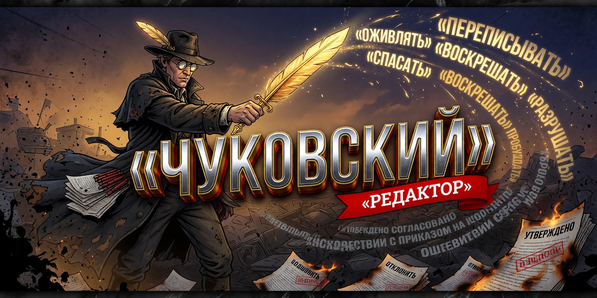

<p align="center">
  
</p>

# Чуковский

> **Claude Code-скил (команда `/chukovsky`): литературный и смысловой редактор для русскоязычного текста. Работает со смыслом, структурой, ясностью и логикой — но не переписывает автора. Два режима: разобрать и показать флаги или править на месте. Жанровый режим (Инфостиль / Гибрид / Голос / Устная речь) выбирается ДО правки и меняет сами правила.**

[](LICENSE)
[](https://docs.claude.com/en/docs/claude-code/overview)

Даёте текст — Claude проходит по нему как живой редактор: смотрит структуру (есть ли
тезис, не переставляются ли абзацы), ясность (канцелярит, переводные кальки, длинные
предложения), логику (не подменяется ли тезис, следует ли вывод) и голос (не
стерилизовал ли я текст после правки). Возвращает таблицу флагов с цитатами и
правками — и (в режиме Правка) отредактированный текст.

```
/chukovsky <вставьте текст>
→ Режим: Правка. Жанр: Гибрид. Цель A→Б: ясна.
→ Флагов: 7 (важных: 3, косметика: 4). Факт-флагов: 2.
→ ОТРЕДАКТИРОВАННЫЙ ТЕКСТ: ...
```

<p align="center">
  <br>
  <sub><i>«Живой как жизнь» — против канцелярита</i></sub>
</p>

---

## Зачем

LLM-редактура обычно сваливается в одну из двух крайностей: либо текст почти не
меняется («косметика поверх дефектов»), либо его стерилизуют — выровняли ритм,
вырезали разговорные обороты, заменили живые формулировки на правильные. Получается
чистый, но безликий текст. Главная ошибка инструмента-редактора — именно стерилизация.

«Чуковский» собран против этой ошибки. Имя — в честь Корнея Чуковского
(«Живой как жизнь»): живая речь против канцелярита. Скил правит **объективные** дефекты
(канцелярит, цепи родительных, сломанная логика, нарушенная структура) и **предлагает**
вкусовое (ритм, синонимы, метафоры) — но не вносит его молча. Голос автора неприкосновенен.

## Как работает

В основе — три правила, без которых скил вредит:

1. **Объективное правлю — вкусовое предлагаю.** Канцелярит, отглагольные, цепи
   родительных, пассив без нужды, плеоназм, пустая оценка, логическая дыра — правлю
   смело. Ритм, синонимы, разговорность, авторский штамп-маркер стиля — только в
   раздел «На решение автора». Тест: **если обоснование = «мне так лучше» — это вкус.**
2. **Голос автора неприкосновенен.** При сомнении «это автор или ошибка» — оставить.
   Один живой авторский оборот ценнее трёх вычищенных канцеляризмов.
3. **Минимальная достаточная правка.** Три действия вместо двух:
   **править / пометить на решение автора / оставить.** Действия взаимоисключающие:
   что попало в «На решение автора», в итоговый текст не вносится.

Четыре прохода:

1. **Жанр и цель** — режим (Инфостиль / Гибрид / Голос / Устная речь) и куда читатель
   приходит к концу (A→Б). Без цели — флаг «зачем этот текст».
2. **Структура (сверху вниз)** — есть ли явный тезис; тест перестановки абзацев;
   аргументы по нарастанию силы; рабочий зачин и концовка. Для книги/лонгрида —
   реверс-оглавление «глава → утверждение → доказательство».
3. **Ясность и сокращение** — канцелярит, переводные кальки и ложные друзья,
   стоп-слова Ильяхова (как сигнал к проверке, не автозамена), длинные предложения
   (>20 слов тяжелеют, >30 — красный флаг).
4. **Логика и факты** — 4 закона (тождество, противоречие, достаточное основание,
   однородность перечислений), логические уловки (ложная дилемма, ad hominem,
   ложная аналогия), факт-флаги на сомнительные цифры/даты/цитаты (помечает, **не правит**).
5. **Голос и самопроверка** — не стерилизовал ли? Не выровнял ли ритм? Не просел ли
   финал? Если текст стал чистым, но безликим — вернуть автора, не добавляя клише.

## Жанровый режим (выбирается первым)

Главная фишка: одни и те же правила губят разные тексты. Инфостиль уместен для
коммерции и новости, но убивает эссе и художку. Поэтому режим определяется ДО правки.

| Текст | Режим | Что это значит |
|-------|-------|----------------|
| Новость, документ, инструкция, лендинг | **Инфостиль** | максимальная плотность, факты вместо оценок, голос вторичен |
| Научпоп, лонгрид, экспертный пост | **Гибрид** | ясность + сохранённая интонация, объяснение через известное |
| Эссе, колонка, художка, личный пост | **Голос** | отступления, ритм, «вода» — это ЦЕННОСТЬ; тяжёлая правка = порча |
| Расшифровка (интервью, надиктовка) | **Устная речь** | уровень обработки от дословного до литературного; беречь характерные словечки |

В режиме «Голос» стоп-слова и сокращение почти не применяются — правятся только
объективные дефекты (явный канцелярит, логика, факты).

## Режимы работы

| Режим | Когда | Что делает |
|-------|-------|------------|
| **Правка** (по умолчанию) | «отредактируй», «прогони через Чуковского», «/chukovsky» | разбирает + правит + отдаёт текст |
| **Разбор** | «редакторский разбор», «что не так со структурой», «только разбор» | рецензия со списком, текст не трогает |

## Установка

Скил — это два файла в папке `.claude/`. Скопируйте их в свой проект **или**
в глобальную папку Claude Code (`~/.claude/`), чтобы скил был доступен везде.

**В конкретный проект:**
```bash
git clone https://github.com/beaverbeard/chukovsky.git
cp -r chukovsky/.claude/skills/chukovsky      .claude/skills/
cp    chukovsky/.claude/commands/chukovsky.md .claude/commands/
```

**Глобально (во все проекты):**
```bash
cp -r chukovsky/.claude/skills/chukovsky      ~/.claude/skills/
cp    chukovsky/.claude/commands/chukovsky.md ~/.claude/commands/
```

Перезапустите Claude Code — скил «Чуковский» (`chukovsky`) и команда `/chukovsky` появятся в списке.

## Использование

```bash
# Вставить текст прямо в команду
/chukovsky <вставьте текст>

# Или вызвать команду и вставить текст следующим сообщением
/chukovsky

# Только разбор, без правки
/chukovsky только разбор: <текст>
```

Или просто словами: «прогони этот текст через Чуковского», «отредактируй»,
«проверь структуру», «что не так с этим текстом».

## Что Чуковский правит

Несколько примеров из чек-листа:

- **Канцелярит:** отглагольное → глагол («осуществление работы» → «работать»);
  цепи 3+ родительных → разбить («процесс улучшения качества обслуживания»);
  «который… который» → переструктурировать; пассив без нужды → актив с деятелем.
- **Переводные кальки:** «свой/его» там, где излишне; «тот факт что»;
  «являющийся»; лишнее «это» как калька `it`; SVO-порядок слов вместо естественного.
- **Ложные друзья переводчика:** актуальный ≠ actual, контролировать ≠ control,
  патетический ≠ pathetic, симпатичный ≠ sympathetic.
- **Пустые оценки и стоп-слова:** «уникальный», «лучший», «максимально»,
  «абсолютно», «по сути», «в принципе» — как **сигнал к проверке**, не автозамена.
- **Длинные предложения:** >20 слов тяжелеют, >30 — красный флаг. Прокси — чтение вслух.
- **Структура:** нет явного тезиса; абзацы переставляются без потери смысла;
  аргументы не по нарастанию; зачин или концовка не работают; повторы одной мысли.
- **Логика:** тезис подменяется; вывод не следует из аргументов; перечисления
  неоднородны; уловки (ложная дилемма, ad hominem, после-этого→вследствие).
- **Факт-флаги:** сомнительные цифры, даты, имена, цитаты → «проверить», **не править самому**.

Полный список — в [`SKILL.md`](.claude/skills/chukovsky/SKILL.md).

## Что Чуковский НЕ делает

- **Не переписывает за автора.** Замысел, сюжетные решения, авторский голос
  остаются. Правка усиливает текст, не подменяет его.
- **Не правит факты.** Сомнительные утверждения, цифры, цитаты помечаются
  «проверить» — но не исправляются.
- **Не вносит вкусовое молча.** Спорное идёт в раздел «На решение автора» — это
  предложения, не правки. То, что попало туда, в финальный текст не вносится.
- **Не трогает цитаты.** Чужой текст в кавычках остаётся как есть.
- **Не орфография и не пунктуация.** Это другая, отдельная задача.
- **Не ловля AI-маркеров.** Если в тексте есть «нейрослоп» — это тоже отдельная задача.

## Настройка под себя

Скил **opinionated**. По умолчанию он работает в стиле русской редакторской традиции
(Чуковский, Норá Галь, Ильяхов): живой язык против канцелярита, факт против пустой
оценки, голос автора над «правильным текстом». Если ваша задача — академический
текст, юридический документ, технический мануал, — отредактируйте `SKILL.md` под
свой формат: это обычный Markdown.

Особенно полезно подкрутить:
- **Стоп-слова Ильяхова** — для научной статьи они избыточны.
- **Жанровый режим** — добавить свой (например, «техдок»).
- **Чек-лист контекстных добавок** — продающий текст, веб-копирайт, устная речь
  имеют свои разделы.

## Ограничения

- **Только русский.** Чек-лист, кальки и стоп-слова собраны под русскоязычный текст.
- **Стиль и смысл, не факты.** Скил проверяет внутреннюю непротиворечивость, но не
  ходит во внешние источники проверять цифры.
- **Цитаты не трогает.** Чужой текст в кавычках остаётся как есть.
- **Opinionated по умолчанию.** Часть правил вкусовая (стоп-слова, длина предложений);
  под свой формат стоит подкрутить.

## FAQ

**Это переписывает мой текст?** В режиме Правка — правит точечно (канцелярит,
длинные предложения, явная логическая дыра). Не переструктурирует и не меняет
замысел. Вкусовое (ритм, синонимы, метафоры) идёт в «На решение автора» —
предложения, не правки. Хотите без правок — режим Разбор.

**Чем отличается от чистильщиков AI-текста?** Чистильщики AI смотрят на статистические
маркеры машинного письма (канцелярит, нейротропы, кальки). Чуковский смотрит на
**смысл и структуру**: есть ли тезис, следует ли вывод из аргументов, не
подменяется ли тема. Это разные задачи и они не пересекаются.

**Работает с эссе и художкой?** Да. В режиме «Голос» инфостиль и сокращение почти
не применяются — правятся только объективные дефекты (явный канцелярит, логика,
факты). Один живой авторский оборот ценнее трёх вычищенных канцеляризмов.

**Что такое «На решение автора»?** Раздел вывода, в который идёт всё спорное и
вкусовое: предложения по ритму, выбору синонимов, разговорным оборотам, метафорам.
Это **не правки** — они в финальный текст не вносятся. Решает автор.

**Что такое факт-флаг?** Сомнительная цифра, дата, имя, цитата или утверждение
без основания. Чуковский **не правит** такие места — только помечает «проверить»
с пометкой, что именно сомнительно.

**А если откатываю больше половины правок?** Значит скил перередактировал —
ужесточите порог в `SKILL.md` (раздел «Калибровка»). По умолчанию порог уже высокий:
правится только то, что доказывается правилом или объективным дефектом.

## Вклад

PR и issue приветствуются. Скил — это обычный Markdown в
`.claude/skills/chukovsky/SKILL.md`, менять легко. Идеи: профили под разные
форматы (академический / технический / юридический), английская версия,
расширение списка ложных друзей и калек.

## Лицензия

[MIT](LICENSE) © 2026 Rodion Scryabin ([@beaverbeard](https://github.com/beaverbeard))
