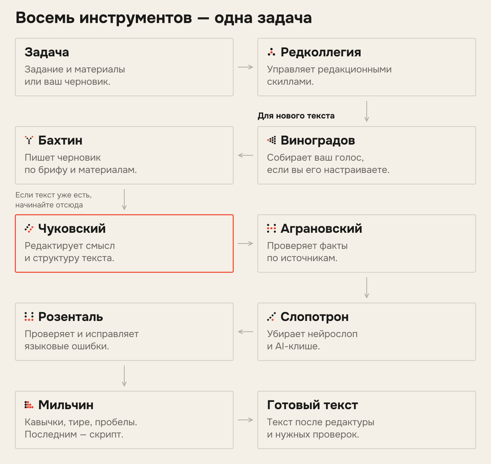

[Русский](README.md) · [English](README.en.md)

<picture>
  <source media="(prefers-color-scheme: dark)" srcset="assets/brand/cover-ru-dark.svg">
  
</picture>

# Чуковский

**Специально для русского языка.** Редактирует тексты. Выстраивает мысль, исправляет провалы в логике и убирает канцелярит.

[Как установить?](#как-установить) · [Примеры задач](#примеры-задач)

## Как это работает

Вы даёте готовый текст и говорите, что важно сохранить. Чуковский смотрит, понятна ли мысль, связаны ли части текста и нет ли повторов или тяжёлых оборотов. Затем предлагает конкретные правки и объясняет, зачем они нужны.


## Примеры задач

### Улучшить черновик

> Отредактируй статью через Чуковского: выстрой мысль, убери повторы и канцелярит. Сохрани мои примеры и интонацию. Спорные изменения покажи отдельно.

### Получить редакторский разбор

> Разбери текст Чуковским, пока не переписывая. Где теряется мысль, не хватает перехода или вывод не следует из примера? Покажи конкретные места и объясни проблему.

### Настроить ритм

> Проверь ритм текста. Найди монотонные конструкции и механическую нарезку на короткие фразы. Предложи точечные правки, сохраняя мой голос.


## Как установить?

### Для агентов

Claude Code, Codex / ChatGPT Desktop, Cursor, GitHub Copilot, Gemini CLI — отдайте агенту команду:

```text
Установи скилл «Чуковский»:
https://github.com/beaverbeard/chukovsky

Используй его, когда мы пишем или редактируем тексты.
```

<details>
<summary>Ещё варианты</summary>

Настройка для каждого агента: [Claude Code](docs/OTHER-APPS.ru.md#claude-code), [ChatGPT Desktop / Codex](docs/OTHER-APPS.ru.md#codex), [Cursor](docs/OTHER-APPS.ru.md#cursor), [GitHub Copilot](docs/OTHER-APPS.ru.md#copilot), [Gemini CLI](docs/OTHER-APPS.ru.md#gemini-cli).

### ChatGPT, Claude или Gemini в браузере

Скачайте [пакет этого скилла](docs/downloads/chukovsky.zip). Внутри — инструкции, скрипты и ресурсы.

- **ChatGPT:** создайте проект и добавьте инструкции и ресурсы из распакованного пакета. [По шагам](docs/OTHER-APPS.ru.md#chatgpt).
- **Claude:** включите выполнение кода и загрузите ZIP в Customize → Skills. [По шагам](docs/OTHER-APPS.ru.md#claude).
- **Gemini:** откройте Customize → Skills → Create → Upload и загрузите пакет. [По шагам](docs/OTHER-APPS.ru.md#gemini).

Доступные этапы зависят от инструментов приложения. [Как проверить готовность](docs/OTHER-APPS.ru.md#readiness).

### А лучше — вся Редколлегия

Установите [Редколлегию](https://github.com/beaverbeard/redkollegiya) вместе со всеми восемью скиллами: она подключит нужные инструменты для написания, редактуры и вычитки текста. Отдайте агенту команду:

```text
Установи Редколлегию и весь комплект из восьми редакционных скиллов:
https://github.com/beaverbeard/redkollegiya

Используй их, когда мы пишем или редактируем тексты.
```

</details>


## Когда понадобится ваше решение

Смысловые и спорные изменения требуют вашего решения. Чуковский показывает такие места отдельно; редакторская правка не заменяет проверку фактов.

## Что внутри

Чуковский выполняет свою часть работы с текстом. Для полного процесса начните с [Редколлегии](https://github.com/beaverbeard/redkollegiya): она подключает нужные инструменты.

<picture>
  <source media="(prefers-color-scheme: dark) and (max-width: 600px)" srcset="assets/brand/system-map-ru-dark-narrow.svg">
  <source media="(prefers-color-scheme: dark)" srcset="assets/brand/system-map-ru-dark.svg">
  <source media="(max-width: 600px)" srcset="assets/brand/system-map-ru-light-narrow.svg">
  
</picture>

Вся система состоит из восьми скиллов. Ниже — задачи каждого и ссылки на их репозитории.

| Скилл | Чем поможет |
|---|---|
| [Редколлегия / Redkollegiya](https://github.com/beaverbeard/redkollegiya) | Пишет и редактирует тексты. Помогает пройти путь от первого черновика до проверки фактов и финальной вычитки. |
| [Виноградов / Vinogradov](https://github.com/beaverbeard/vinogradov) | Помогает ИИ писать в вашем стиле: изучает ваши тексты и собирает профиль авторского голоса. |
| [Бахтин / Bakhtin](https://github.com/beaverbeard/bakhtin) | Пишет посты, письма и статьи по вашему брифу и материалам, учитывая нужный стиль. |
| [Чуковский / Chukovsky](https://github.com/beaverbeard/chukovsky) | Редактирует тексты. Выстраивает мысль, исправляет провалы в логике и убирает канцелярит. |
| [Аграновский / Agranovsky](https://github.com/beaverbeard/agranovsky) | Скилл-фактчекер для текстов. Проверяет цифры, даты, цитаты и ссылки, показывает источники. |
| [Слопотрон / Slopotron](https://github.com/beaverbeard/slopotron) | Очищает тексты от нейрослопа и AI-клише, которые всех бесят. |
| [Розенталь / Rozental](https://github.com/beaverbeard/rozental) | Скилл-корректор: проверяет и исправляет тексты. Находит ошибки в орфографии, пунктуации и грамматике. |
| [Мильчин / Milchin](https://github.com/beaverbeard/milchin) | Скилл-типограф: приводит текст к нормам русской типографики. Проверяет и исправляет кавычки, тире и пробелы. |

## Рассылка «рИИдактор»

В «рИИдакторе» мы разбираем, как писать и редактировать тексты с ИИ.

Учимся давать понятные задания, сохранять свой голос и замечать то, что нейросеть придумала за вас. Берите приёмы в работу, чтобы тратить меньше времени на переделки и увереннее выпускать тексты.

[Подписаться на рассылку →](https://redaktozavr.ru/rAIdactor?utm_source=skills)


## Почему «Чуковский»

<picture>
  <source media="(prefers-color-scheme: dark) and (max-width: 600px)" srcset="assets/people/biography-ru-dark-mobile.png">
  <source media="(max-width: 600px)" srcset="assets/people/biography-ru-light-mobile.png">
  <source media="(prefers-color-scheme: dark)" srcset="assets/people/biography-ru-dark.png">
  
</picture>

Фото: Л. Бергольцев / Главархив Москвы · [источник и условия](assets/people/CREDITS.md).

## Совместимость и исходники

При подключении проверьте доступные инструменты выбранного приложения. Английская страница содержит перевод документации.

[SKILL.md](https://github.com/beaverbeard/chukovsky/blob/b71639152a9482f8c6c0e9718f9db17d933d95a7/.claude/skills/chukovsky/SKILL.md) · [MIT](https://github.com/beaverbeard/chukovsky/blob/b71639152a9482f8c6c0e9718f9db17d933d95a7/LICENSE)
